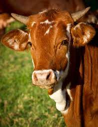

# Инструкция по ЯЗЫКУ Markdown

## Заголовк 2
### Заголовк 3
#### Заголовок 4


## Списки / Lists
### Ненумерованный список / Dot list
* Лист / List
* Лист / List
* Лист / List
### Нумерованный список / Number list
1. Лист 1 / List 1
2. Лист 2 / List 2
3. Лист 3 / List 3


## Обрамление кода
Пример на С
```C
int main(void) {
	printf("Hello world");
}
```
Пример на Python
```python
print("Hello world")
```


Это корова:
, 

some text